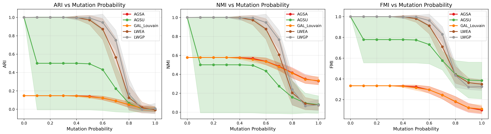
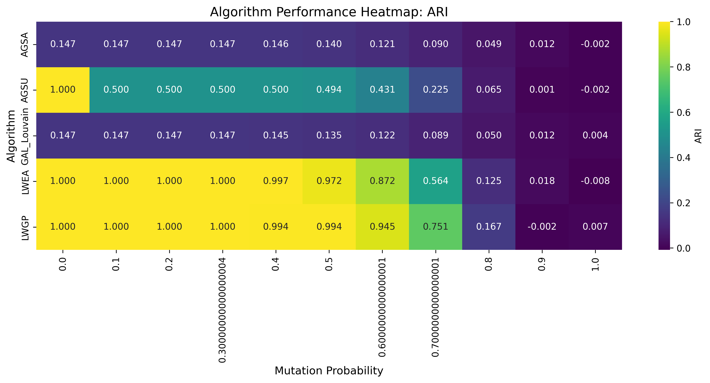
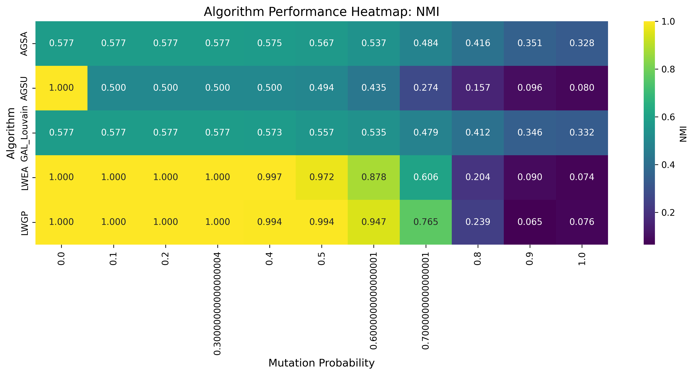
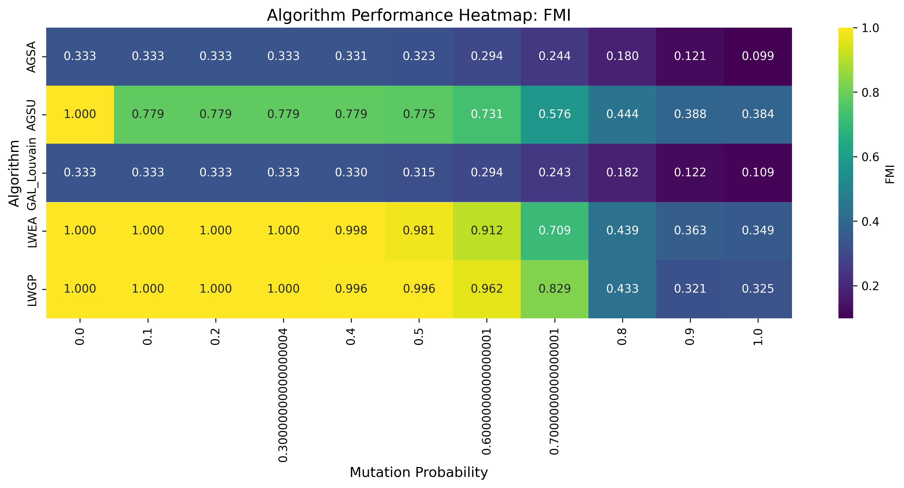
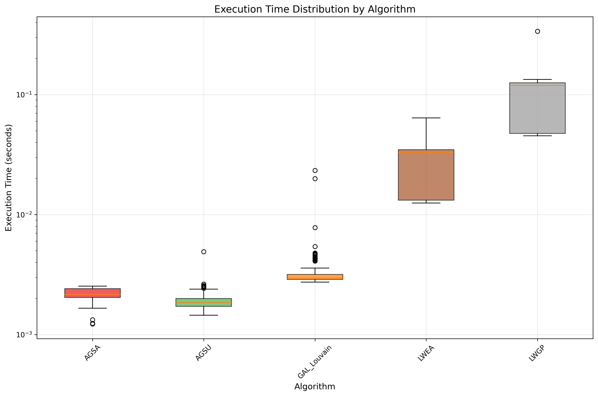
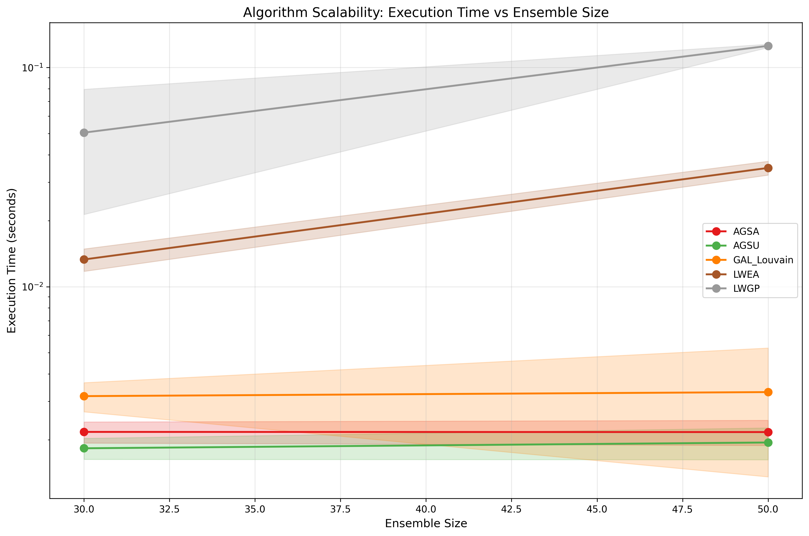
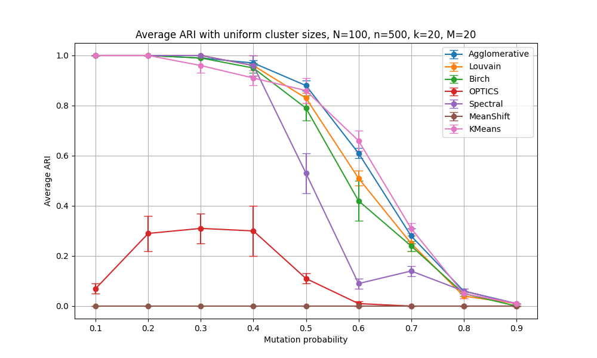
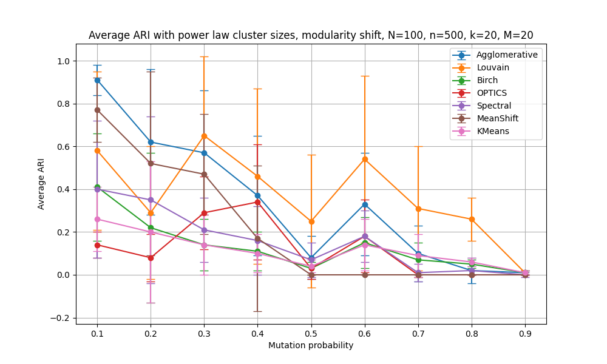
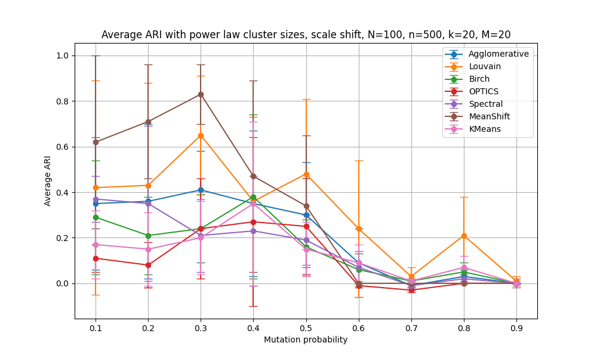

# Consensus Clustering 2025 HSE Parinov-Ukhanov


Course work 2025
## Submitted by
**Student**: Ukhanov Aleksandr Iurevich #БПАД221, 3rd year of study

**University**: HSE University

# Results 
### Clustmutation comparison comprehensive

### Heatmaps



### Scalability analysis




# Consensus Clustering 2024 HSE Mirkin-Ukhanov

Course work 2024
## Submitted by
**Student**: Ukhanov Aleksandr Iurevich #БПАД221, 2rd year of study

**University**: HSE University

## Deployed version

You can find deployed platform at my server via link below. Please note that platform does not support multiple users at ones so make sure you are the only one using it. 

https://consensus.spnya.ru

---


## Features
- Input partitions via a web form
- Choose shift transformation (None, Modularity Shift, Scale Shift)
- Select clustering algorithm (Summary Criterion, Semi-Average Criterion)
- Display clustering results
- Visualize dendrogram of clustering results

## Technological stack
- Flask
- NumPy
- Matplotlib
- SciPy

## Installation and usage
1. Install the required packages:
   ```sh
   python3 -m pip install -r requirements.txt
   ```

2. Export environmental variables for Database :
   ```sh
   export DB_USER=name
   export DB_PASSWORD=pass
   ```

3. Start the Flask application:
   ```sh
   python app.py
   ```

4. Open your web browser and navigate to:
   ```
   http://localhost:8000/
   ```

3. Use the provided form to input partitions, select the shift transformation and clustering algorithm, and submit to view the clustering results and dendrogram.

# Results 
### Clustering for uniform sizes

### Clustering for power law sizes with modularity shift

### Clustering for power law sizes with scale shift

